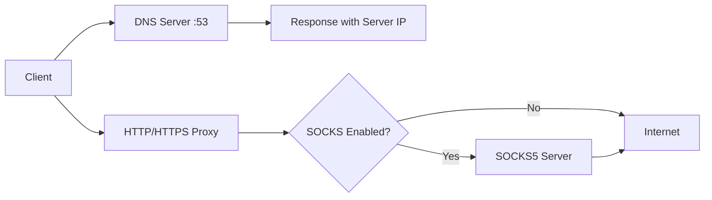

# GoDnsProxy

🌐 SmartDnsProxy

A Powerful Smart DNS Proxy with HTTP/3 and SOCKS5 Support

https://img.shields.io/badge/License-GPLv3-blue.svg
https://img.shields.io/badge/Go-1.18+-00ADD8?logo=go
https://img.shields.io/github/stars/aminranjibar2007/GoDnsProxy

---

📖 About

SmartDnsProxy is a smart DNS proxy that redirects all DNS requests to a specified IP address and proxies HTTP/HTTPS traffic as well. With support for the latest protocols like HTTP/3 (QUIC) and the ability to connect to a SOCKS5 server, this tool provides a complete solution for network traffic management.

✨ Key Features

· ✅ Smart DNS: Redirect all DNS requests to a custom IP
· ✅ HTTP Proxy: Full support for HTTP requests on port 80
· ✅ HTTPS Proxy: CONNECT tunneling for HTTPS on port 443
· ✅ HTTP/3 Support: Latest protocol over UDP with high performance
· ✅ SOCKS5 Integration: Optional outgoing traffic through SOCKS5 server
· ✅ Customizable: Change IP and settings with a few lines of code
· ✅ Lightweight & Fast: Written in Go with efficient resource usage
· ✅ Open Source: Licensed under GNU GPL v3.0

---

🏗️ Architecture

```
┌─────────────────────────────────────────────────┐
│              SmartDnsProxy                      │
├─────────────────────────────────────────────────┤
│                                                 │
│  📡 DNS Server (UDP 53)                       │
│     └─> All domains → Your Server IP          │
│                                                 │
│  🌐 HTTP Proxy (TCP 80)                       │
│     └─> Proxy HTTP requests                    │
│                                                 │
│  🔒 HTTPS Proxy (TCP 443)                     │
│     └─> CONNECT tunneling for HTTPS           │
│                                                 │
│  🚀 HTTP/3 Proxy (UDP 443)                    │
│     └─> Proxy QUIC/HTTP3 requests             │
│                                                 │
│  🔄 SOCKS5 (Optional)                          │
│     └─> All outgoing traffic via SOCKS        │
└─────────────────────────────────────────────────┘
```

Data Flow:



---

🚀 Installation & Setup

Prerequisites

· OS: Linux (Ubuntu/Debian) or Windows Server
· Go: Version 1.18 or higher
· Root Access: Required for ports 53, 80, and 443
· Git: For cloning the repository

---

📦 Installation on Linux (Ubuntu/Debian)

1. Install Go

```bash
# Method 1: Install with apt (simpler)
sudo apt update
sudo apt install -y golang-go

# Method 2: Install latest version from official site
wget https://go.dev/dl/go1.22.5.linux-amd64.tar.gz
sudo tar -C /usr/local -xzf go1.22.5.linux-amd64.tar.gz
echo 'export PATH=$PATH:/usr/local/go/bin' >> ~/.bashrc
source ~/.bashrc
```

2. Clone the Repository

```bash
git clone https://github.com/aminranjibar2007/GoDnsProxy.git
cd GoDnsProxy
```

3. Install Dependencies

```bash
go mod tidy
```

4. Configure Server IP

Open main.go and change the SystemIP variable to your server's IP address:

```go
var (
    SystemIP      = "YOUR_SERVER_IP_HERE"  // e.g., 192.168.1.100
    SocksServer   = ""                      // If needed
    SocksPort     = ""
)
```

5. Build the Program

```bash
go build -o smartdnsproxy main.go
chmod +x smartdnsproxy
```

6. Disable systemd-resolved

Important: Before running, configure systemd-resolved to stop listening on port 53:

```bash
# Edit configuration file
sudo nano /etc/systemd/resolved.conf

# Set the following values:
# DNSStubListener=no

# Then restart the service:
sudo systemctl restart systemd-resolved
```

Note: We don't completely disable systemd-resolved, we only stop it from listening on port 53.

7. Run the Program

Method 1: Run with tmux (Background)

```bash
# Install tmux
sudo apt install -y tmux

# Run in tmux
tmux new -s smartdns
./smartdnsproxy
# Press Ctrl+B, D to detach from tmux

# Reattach to tmux
tmux attach -t smartdns
```

Method 2: Create systemd Service (Recommended)

```bash
sudo nano /etc/systemd/system/smartdnsproxy.service
```

Service file content:

```ini
[Unit]
Description=SmartDnsProxy - Smart DNS Proxy Service
After=network.target
Before=nss-lookup.target

[Service]
Type=simple
User=root
WorkingDirectory=/opt/GoDnsProxy
ExecStart=/opt/GoDnsProxy/smartdnsproxy
Restart=always
RestartSec=5
StandardOutput=journal
StandardError=journal

[Install]
WantedBy=multi-user.target
```

Then:

```bash
sudo systemctl daemon-reload
sudo systemctl enable smartdnsproxy
sudo systemctl start smartdnsproxy
sudo systemctl status smartdnsproxy
```

---

🪟 Installation on Windows Server

1. Install Go

Download and install from golang.org

2. Clone Repository

```cmd
git clone https://github.com/aminranjibar2007/GoDnsProxy.git
cd GoDnsProxy
```

3. Install Dependencies

```cmd
go mod tidy
```

4. Configure IP

Edit main.go and change SystemIP to your Windows server IP.

5. Build

```cmd
go build -o smartdnsproxy.exe main.go
```

6. Run

```cmd
# Direct run
smartdnsproxy.exe

# Run in background with PowerShell
Start-Process -NoNewWindow -FilePath ".\smartdnsproxy.exe"
```

---

⚙️ Advanced Configuration

SOCKS5 Configuration

To route outgoing traffic through a SOCKS5 server:

```go
var (
    SystemIP      = "192.168.1.100"
    SocksServer   = "192.168.1.50"   // SOCKS server address
    SocksPort     = "1080"            // SOCKS port
)
```

Change Ports

You can change ports in the main() function:

```go
func main() {
    go startDNSServer(":53")     // Change DNS port
    go startHTTPProxy(":8080")   // Change HTTP port
    go startHTTPSProxy(":8443")  // Change HTTPS port
    startHTTP3Proxy(":8443")     // Change HTTP/3 port
}
```

---

📊 Service Status & Logs

Useful Commands

```bash
# Check service status
sudo systemctl status smartdnsproxy

# View logs
sudo journalctl -u smartdnsproxy -f

# Stop service
sudo systemctl stop smartdnsproxy

# Restart service
sudo systemctl restart smartdnsproxy
```

Program Logs

The program logs automatically:

```bash
# View real-time logs
sudo journalctl -u smartdnsproxy -f

# View yesterday's logs
sudo journalctl -u smartdnsproxy --since yesterday
```

---

🖥️ Client Configuration

Configure DNS on Clients

Set DNS address to your server IP:

· Windows: Control Panel → Network → DNS → YOUR_SERVER_IP
· Linux: /etc/resolv.conf → nameserver YOUR_SERVER_IP
· Android: Settings → Network → Private DNS → YOUR_SERVER_IP
· iOS: Settings → Wi-Fi → Configure DNS → YOUR_SERVER_IP
· Mac: System Preferences → Network → DNS → YOUR_SERVER_IP

Configure Proxy in Browser

· HTTP Proxy: http://YOUR_SERVER_IP:80
· HTTPS Proxy: http://YOUR_SERVER_IP:443
· SOCKS5: socks5://YOUR_SERVER_IP:1080 (if configured)

---

🛠️ Troubleshooting

Issue: Port 53 is in use

```bash
# Find program using port 53
sudo lsof -i :53

# Stop systemd-resolved from listening on port 53
sudo nano /etc/systemd/resolved.conf
# Set: DNSStubListener=no
sudo systemctl restart systemd-resolved
```

Issue: Program won't start

```bash
# Check compilation errors
go build -v

# Verify dependencies
go mod verify

# Run with verbose logging
./smartdnsproxy 2>&1 | tee log.txt
```

Issue: DNS not responding

```bash
# Test DNS
nslookup google.com YOUR_SERVER_IP

# If not working, check firewall
sudo ufw allow 53/udp
sudo ufw allow 80/tcp
sudo ufw allow 443/tcp
```

---

📝 go.mod File

Ensure proper package installation with this go.mod:

```go
module github.com/aminranjibar2007/GoDnsProxy

go 1.18

require (
    github.com/lucas-clemente/quic-go v0.33.0
    github.com/lucas-clemente/quic-go/http3 v0.3.0
    golang.org/x/net v0.12.0
)
```

---

🤝 Contributing

We welcome contributions! To contribute:

1. Fork the repository
2. Create a feature branch (git checkout -b feature/AmazingFeature)
3. Commit your changes (git commit -m 'Add some AmazingFeature')
4. Push to the branch (git push origin feature/AmazingFeature)
5. Open a Pull Request

---

🐛 Bug Reports & Feature Requests

If you find a bug or have an idea for improvement:

1. Go to Issues
2. Click "New Issue"
3. Enter a descriptive title and detailed description
4. Select appropriate labels (bug/enhancement)

---

📜 License

This project is released under the GNU General Public License v3.0. See the LICENSE file for details.

```
Copyright (C) 2026 aminranjibar2007

This program is free software: you can redistribute it and/or modify
it under the terms of the GNU General Public License as published by
the Free Software Foundation, either version 3 of the License, or
(at your option) any later version.

This program is distributed in the hope that it will be useful,
but WITHOUT ANY WARRANTY; without even the implied warranty of
MERCHANTABILITY or FITNESS FOR A PARTICULAR PURPOSE.  See the
GNU General Public License for more details.

You should have received a copy of the GNU General Public License
along with this program.  If not, see <https://www.gnu.org/licenses/>.
```

---

👨‍💻 Author

aminranjibar2007

· GitHub: @aminranjibar2007
· Project: GoDnsProxy

---

⭐ Support

If you find this project useful, please give it a ⭐ and share it with others!

---

📞 Contact

· Issues: GitHub Issues
· Pull Requests: GitHub Pull Requests

---

Made with ❤️ and Go
